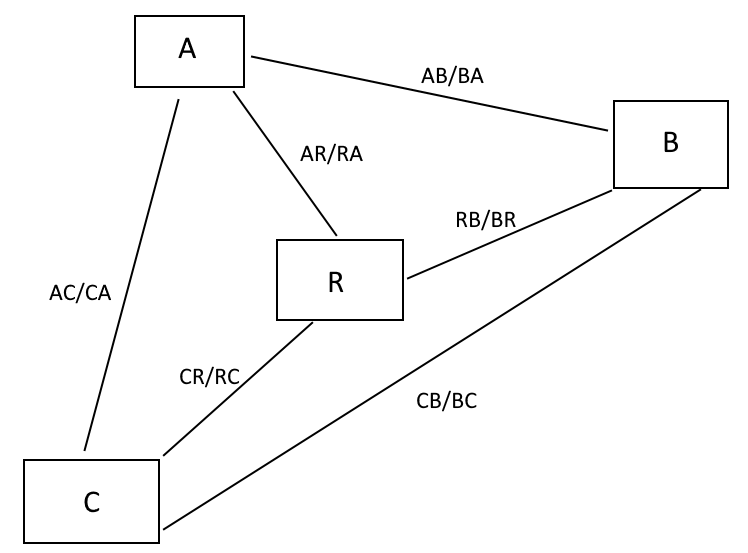

# shortest-cycle-pathway-finder-within-4-points
*shortest-cycle-pathway-finder-within-4-points v1.0*
## Index 
#### [About the program](#intro)
#### [How to use](#how)
#### [How this program works](#how-work)
#### [Requirement](#requiremen)
#### [License](#licens)

<h2 id="intro"> About the program<h/2>
<h4>This is a shortest cycle pathways finder within 4 points, start from point R and cycle through all other points, A, B, C, then return R. All points are connected to each other. For detail, please see the below map: 

The time/distance for forward or backward direction between each point can be different.
<h2 id="how"> How to use<h/2> 

<h4>To use the program, run <i>main.py</i> in console. To input distance/time, modify the value: *time_subpath* dictionary in line 5, input all distance/time for both forward and backward direction between each point. For example, if the time of travel between A and B is 5 with the same forward and backward time/distance, then <i>'ab':5</i>, <i>'ba':5</i>. If a to b is 5 but b to a is 3, then <i>'ab':5</i>, <i>'ba':3</i> <h/4> 
  
<h4>The program will first generate and shows all possible pathways, then calculate and shows the shortest distance/time, and finally the shortest pathway(s). The shortest pathway(s) usually come up in pairs if all points' forward distance/time is the same as backward.<br\><br\>
  
<h4>Below is the example of the outcome, which is the value in the program in default,<h/4>
<h4><i>time_subpath = {'ab':5,'ba':5,'ra':2,'ar':2,'ac':4,'ca':4,'br':7,'rb':7,'cr':1,'rc':1,'bc':3,'cb':3}</i><h/4>

 
  
<h2 id="how-work"> How this program works<h/2>   
<h4>This program works in a very primitive way and is not efficient. Firstly, all possible combinations of 4 points were generated, then all impossible pathways will be removed by using varieties of loops, for example, the first loop that removes pathways that do not start or end in "r" point. I call those loops "filters". I had put some simple notes in the program to shows what loop(s) does what filterings. After that, the program will try all pathways to found 1st fastest first, then seeks for other shortest pathways with the same length.<br\><br\>
  
<h4>Below is a summary flow that shows how this program runs.<h/4> 
  
 

<h2 id="requiremen"> Requirement<h/2>
<h4>python 3.7.3 is recommended with numpy installed <h\4>

<h2 id="licens"> License<h/2>
<h4>This program was distributed under the BSD-3-Clause License.<h\4>

